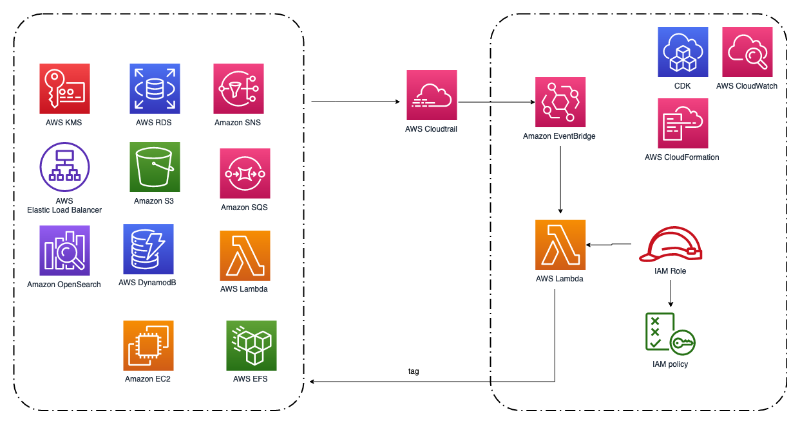

### Prepare:
1. Download the CloudFormation template resource-tagging-automation.yaml
2. An AWS account

### Architecture:

### Deployment:
1. Open the AWS Console, navigate to CloudFormation,
2. Click Create Stack,
3. Click "Upload a template file", select the CloudFormation template downloaded to the local,
4. Enter a name in "Stack name",
5. Parameters section settings,
    A. AutomationTags : Enter the tags that are automatically printed for each resource in the form of json, such as: {"TagName1": "TagValue1","TagName2": "TagValue2"}
    B. EventBridgeRuleName : Enter the name of the EventBridge Rule, default value: resource-tagging-automation-rules
    C. IAMAutoTaggingPolicyName : Enter the name of the created IAM custom managed policy, default value: resource-tagging-automation-policy
    D. IAMAutoTaggingRoleName : Enter the role name created for Lambda, default value: resource-tagging-automation-role
    E. LambdaAutoTaggingFunctionName : Enter the name of the lambda function, default value: resource-tagging-automation-function
6. Click Next, check "I acknowledge that AWS CloudFormation might create IAM resources.", click "Create stack",
7. StackSet takes 3-5 minutes to finish creation.

### Modify tag:
1. Go to the Lambda control interface, select the Lambda function, default value: resource-tagging-automation-function,
2. Go to the Configuration Tab, select Environment variables, click Edit to modify the value of the tags tag,
3. Modify the value (json format) and click Save. When the resource is created later, it will be marked with a new tag.